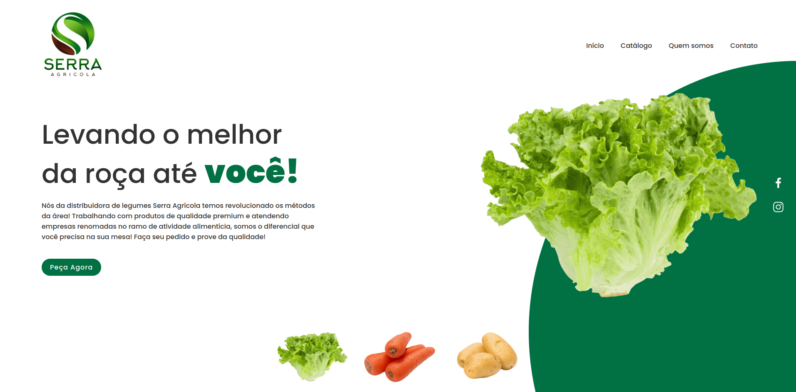

<h1 align="center">Serra Agrícola</h1>

Um dos meus primeiros projetos front-end.

Este é um site institucional de uma distribuidora de legumes e verdurar da região de Teresópolis.

 

Tecnologias utilizadas:
 HTML e CSS
 Javascript
 UI/UX Design
 Git e GitHub

